# Backtesting Engine Diagrams

This document contains visual diagrams for the backtesting engine architecture using Mermaid.js, which renders natively on GitHub.

## System Architecture

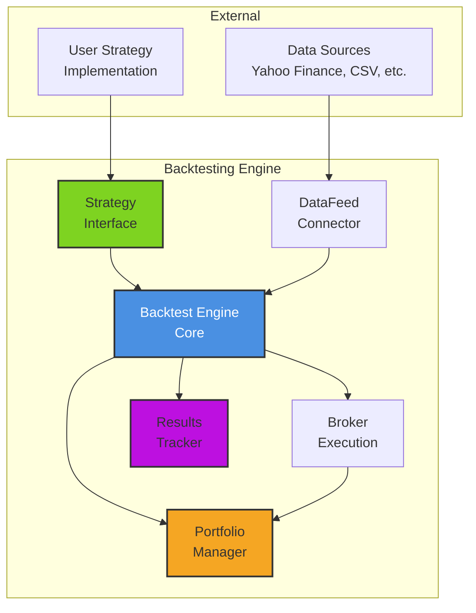

## Component Interaction Sequence

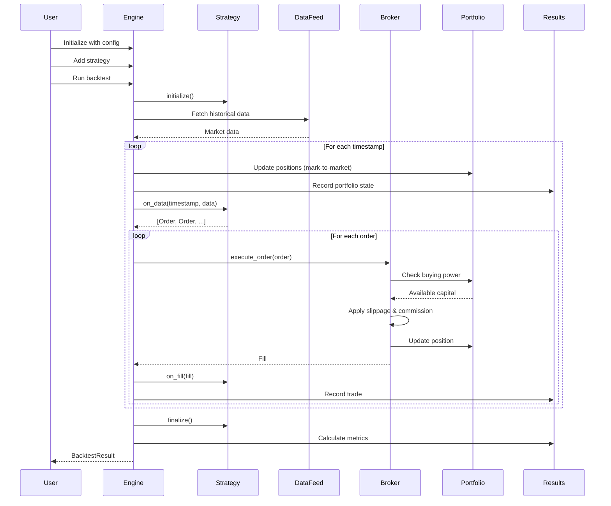

## Class Hierarchy

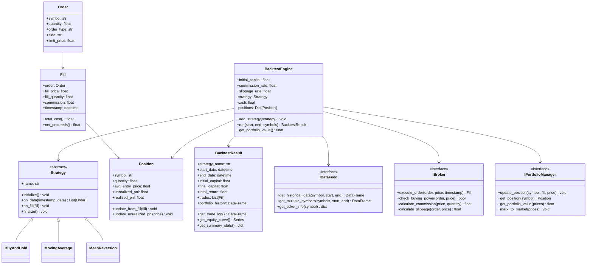

## Event Flow

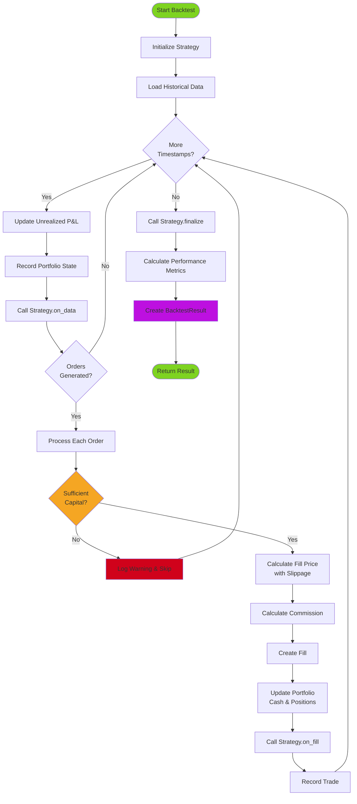

## Order Execution Flow

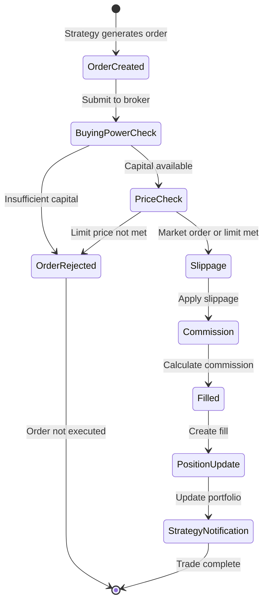

## Data Flow

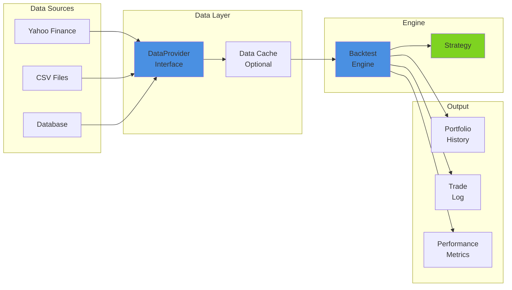

## Portfolio State Transitions

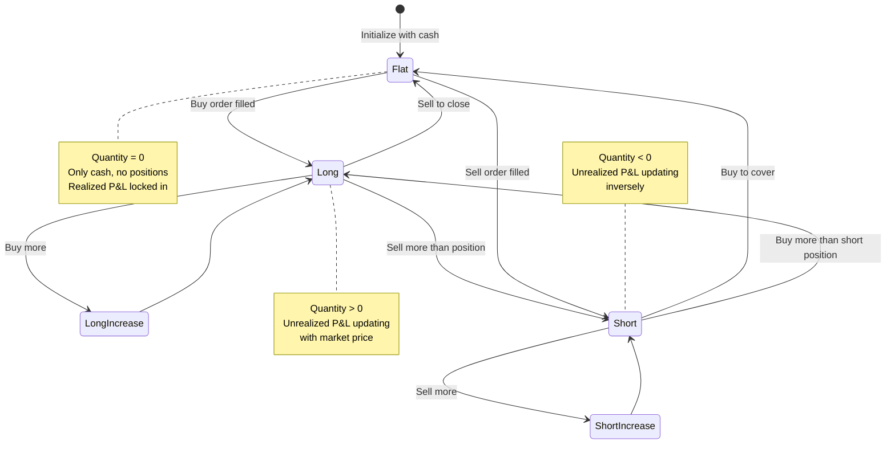

## Strategy Development Pattern

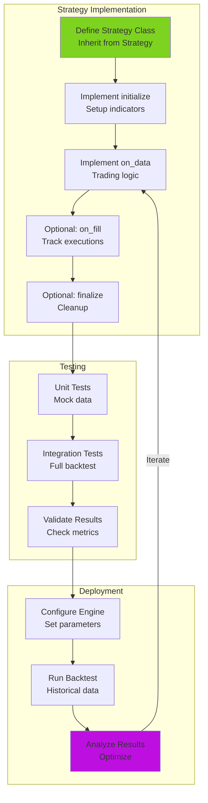

## Performance Analytics Flow

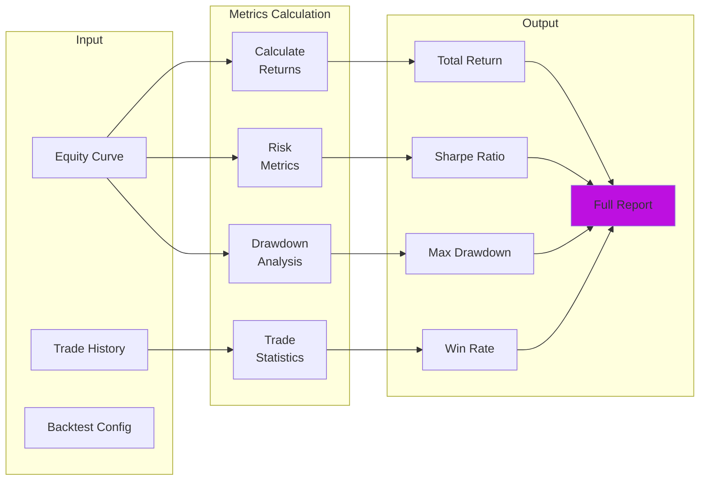

## Multi-Symbol Handling

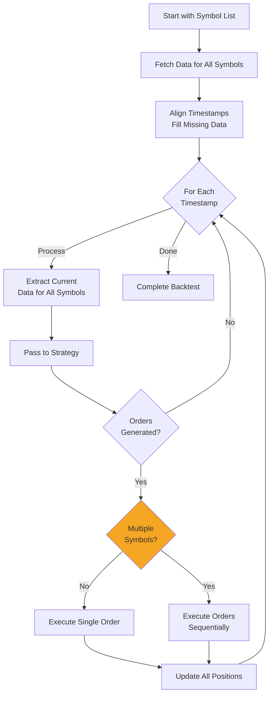

## Extension Points

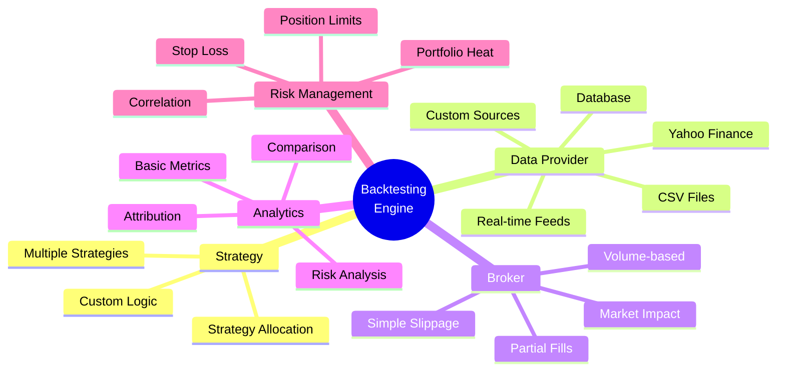

## Usage

These diagrams are rendered automatically on GitHub when viewing markdown files. You can also:

1. **Copy to other docs**: Embed these Mermaid diagrams in any markdown file
2. **Render locally**: Use Mermaid Live Editor (https://mermaid.live/)
3. **Export**: Convert to PNG/SVG using Mermaid CLI
4. **Customize**: Modify colors, layout, and content as needed

## Diagram Updates

When updating the architecture, update the corresponding diagrams to maintain consistency between documentation and implementation.

**Last Updated**: 2026-02-17
